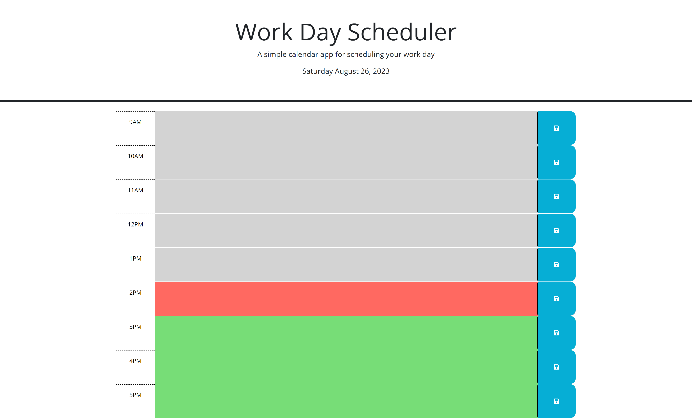

# WorkDayAgenda
An application that manages work day agenda items

## Description
This project was to provide a list of agenda items for a particular work day.  The application has hours between 9 and 5pm each time block has a text area where the user can add details of they are working on for that hour. 
The save button on the right hand side, saves the description into local storage which makes it persists throughout the day.  The application also color codes the time blocks relative to the current hour.  So if the hour in question is in the past, 
present or future, there is a different color indicating if it is in the past, current or future items.  The current date is displayed at the top.  All elements on the screen is generated using JQuery/Javascript. 

## Usage
Below is a screenshot of the completed site

